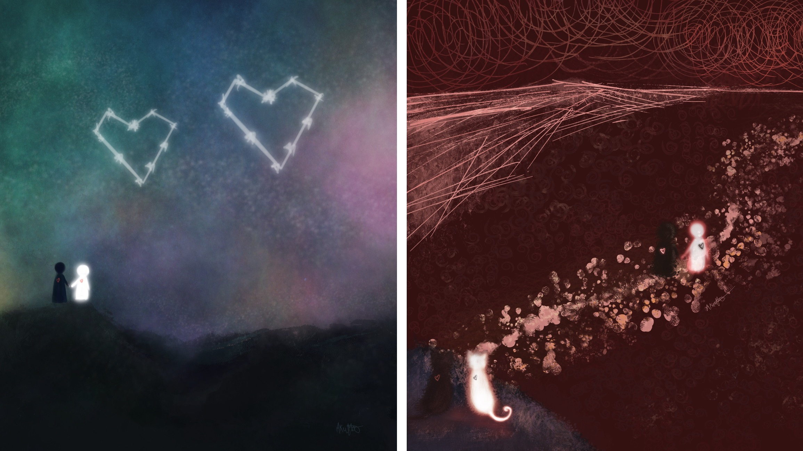

# 2020

## 

## Vibes

This year will be one to remember forever, and not just because of the clean looking number of 2020. It was one of complexity and contrasts. For instance, 2020 brought heartbreaking losses/pain, but also personal growth and more time at home with family. I am grateful for my health of my friends and family, knowing that others were not so lucky. 

We saw this year marvels in science \(the mRNA covid vaccine is an incredible piece of art\), who really keeps society afloat, a new Civil Rights movemet, how much work we still need to do in terms of fighting for science, the earth,  justice and love for _all_ people.

I finished my last semster \(an extremely strange one at that\), and I now have a BS in Biology. I am proud of this accomplishment and am excited for more to come. I am lucky to have had friends that made it so hard to say goodbye. It will be weird to not run/walk on the track and around the neighborhood, accidentally break glassware in chem labs, be able to visit my friends in a 0-10 minute drive, and vibe that sweet, college lifestyle. Though the circumstances were weird & we had to modify a few things, I still got to make a lot of wonderful memories with friends. 

## Sleep 

I prioritized sleep a lot this year, with a tricky semester in the spring, the MCAT in the summer, and then learning to relax in the fall/winter.

I hovered around a monthly average of 8 hours.

## Exercise

My bones/cartilage kept it together for this year! I took it easier \(much easier lol\) this year in terms of mileage, and I think that was a healthy decision. It took a while for my left first metatarsal to heal, and I wanted this year of extra care to my body overall.

Exercise is an incredible outlet for me, especially running/walking.

Those big spikes in walking and workouts is when I returned to school and had a lot of wonderful walks / ab workouts with an amazing friend.

My abs aren’t ripped, but I can do new moves that I wasn’t able to do since like HS. Thank you homie!

Another notable development is that my dad now runs with me. It’s great! I’ve seen him make a lot of progress, and I really enjoy spending time with him.

In terms of running style, I think my natural pace has been a bit faster. I’ve been trying to focus on how I feel instead of time. Freeing my mind has helped me loosen up a bit.

Some fun stats from Smashrun:

   

My half marathon got deferred to next May, and I am still excited for it. I might try to run a fast 5K after I’m in shape for it.

## Nutrition

This year, cooked a ton in my small apartment kitchen.

I made a ton of stir-fry and bowl style meals, as well as fruit smoothies.

 My favorite ingredients were quinoa, linguine, toasted pepitas/cashews, minced ginger, roasted garlic, avocados, frozen veggies, nutritional yeast, and tons of different spices. Curry adobo, and cajun are some of my favorites. 

I enjoy eating so much. 

## Learning

Time flew by, and I just completed my last semester of college. As a curious person, I plan to continue to learn for the rest of my life.

A few topics I want to explore on my own include:

* Immunology
* Javascript
* Anatomical variation
* Rendering light & shadow
* Pathophysiology \(enjoyed this class\)

## Reading

I read a few books for enjoyment, but I honestly hope to read more in 2021. The 20 pages a day fell through when I started my 3 mo wild grind to study for the MCAT. I guess I did read quite a few pages though, but science review material.

## Music

According to Spotify, I discovered 539 artists this year and listened to 41,343 minutes of music. 

I also was surprised with truly amazing earphones for Christmas and I am so grateful! The sound quality and noise cancellation are both so incredible. Listening to favorites with them on sounds like discovering them for the first time, almost! 

I have a pretty wide taste in music, and always trying to discover new songs.

## Art

After I finished the school year, I created a few pieces of work that I’m proud of. I love the freedom I have with digital painting and the slightly wild nature of watercolors. I enjoy sketching and creating characters as well.

Here are the two digital paintings I made. I worked with two pretty different styles.

On Christmas, I got an iPad Air w pencil to share with my mom. We waited a few days to open it, but I've been creating fun art with it ever since. It's so fun and easy to experiment with different colors and textures. 

 I will post regularly on instagram and [behance](https://www.behance.net).



Here's a few pieces I've made with it since I got it:

## Stress

Besides the stress of existential dread that has washed over most of us since March, I’ve felt decently in control emotionally and not too stressed. There were peaks of stress, but I think that’s to be expected during a year like this. I still have a tendency to overthink things and fixate on past mistakes, but I’ve gotten a lot better.

I did not really fall back into meditation, but exercise has been prioritized more. Some walks and runs feel similar to meditation in a way. I’ve been able to run/walk for most of 2020 and have stayed mostly injury free. I contribute consistent exercise to my relatively low stress levels.

Most stress this year came from events larger than myself, compared to last year’s more personal stressors.

**2020**

Thank you to Garmin for this sick graph of physiological stress. I think this differs a bit from emotional stress–May through August were quite stressful as I was studying for the MCAT, one of the most important tests of my life.

Year Overview:

**2019**

## Closing Remarks

I've learned a lot about myself and the world this year, and I am cautiously optimistic about 2021. So grateful for everything I have, and I hope to continue to grow and make a positive impact on the world. 

