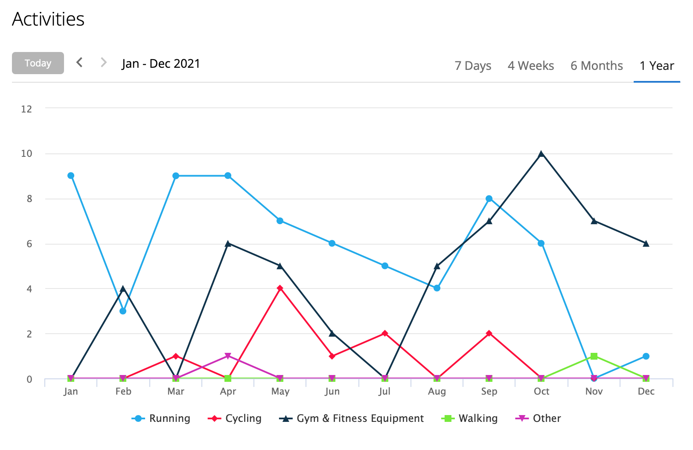
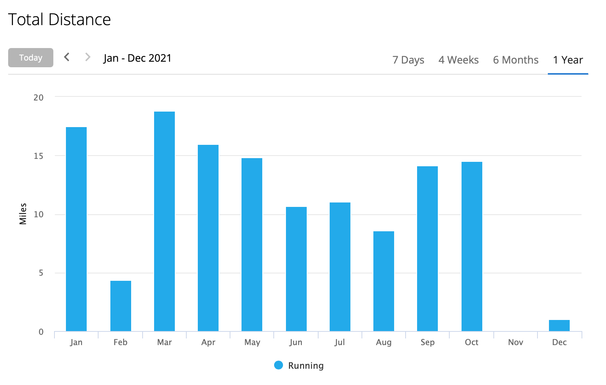
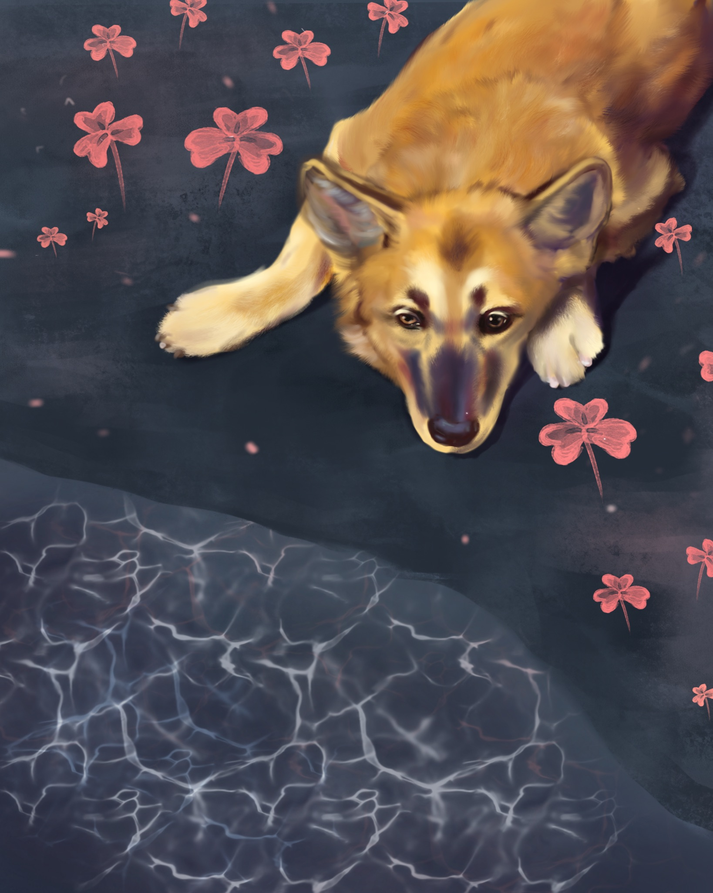
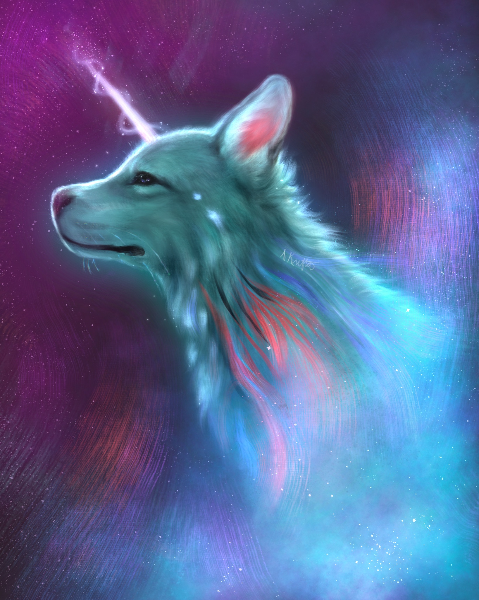
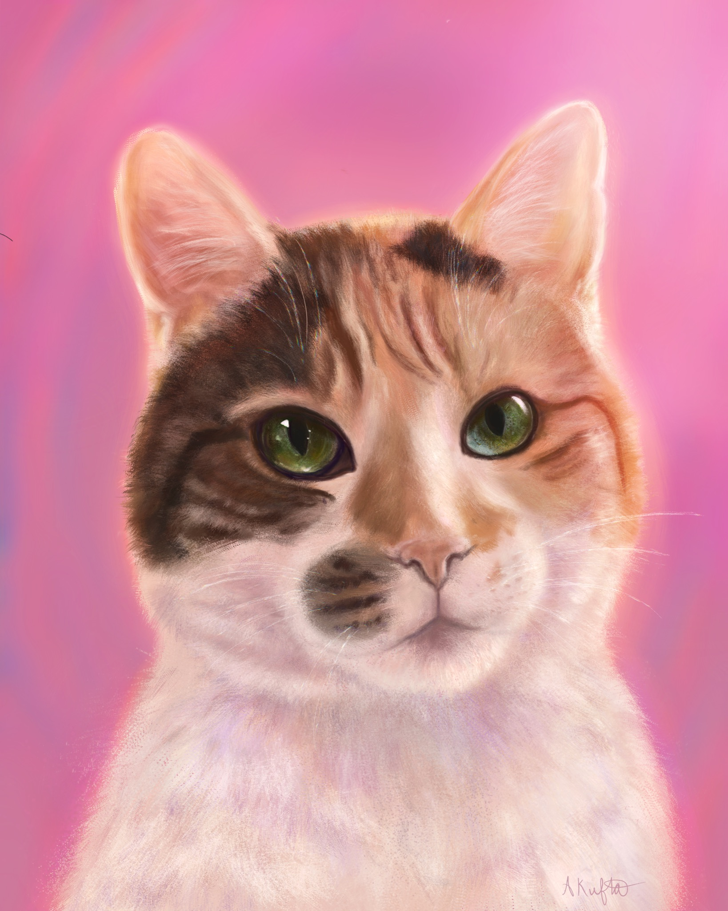

# 2021

2021 Year in Review

## Vibes

Overall, this year challenged me in many ways, though I felt that I experienced a lot of personal growth during this time. Early in the year, I prepared my medical school application, a culmination of all of the hard work I have done for the past four years plus a lot more essay writing. In November, I got accepted to my first med school 10 minutes after receiving a waitlist email. Having received another interview invite yesterday (12/30/21), I am excited to see where I end up. I believe I will end up where I am meant to be.

I also did a six month stint as a preschool teacher, where I learned to appreciate how full of personality kids are, even at only 3 or 4 years old. I then started my internship, which pushed me in big ways professionally and academically. In August, I was slightly injured in a car accident, but I also gained a deeper appreciation for being present in the moment and grateful for the time I have, as every day is not guaranteed.

Overall, this year was a wild one for sure. Another year of the pandemic, and a lot of changes, both beautiful and sad. I feel that I have had better boundaries and have made healthier friendships, especially at my internship. I’ve done things this year that are scary and exciting at the same time. I also got to spend it home with my family, and I don’t regret taking this gap year because I've had the chance to enjoy irreplaceable time with them.

## Stress

### 2021

I feel like I’ve managed my stress decently well, though there were times where I felt it a lot. Writing secondaries felt like a never ending onslaught, but was made a lot better by a few close friends who walked with me in that enjoyable journey haha.

The spike at the end of the year is when I had hefty hours, where I covered for covid and vacations. However, in the last weeks, I’ve felt more peaceful and able to maintain a positive, growth mindset. The high level of stress unexpected helped me gain confidence in myself, and I feel more ready for the future.

I may try returning to meditation in the coming year, as I think going on my phone the first thing in the morning is bad for my stress level haha.

### 2020

Besides the stress of existential dread that has washed over most of us since March, I’ve felt decently in control emotionally and not too stressed. There were peaks of stress, but I think that’s to be expected during a year like this. I still have a tendency to overthink things and fixate on past mistakes, but I’ve gotten a lot better.

I did not really fall back into meditation, but exercise has been prioritized more. Some walks and runs feel similar to meditation in a way. I’ve been able to run/walk for most of 2020 and have stayed mostly injury free. I contribute consistent exercise to my relatively low stress levels.

Most stress this year came from events larger than myself, compared to last year’s more personal stressors.

Thank you to Garmin for this sick graph of physiological stress. I think this differs a bit from emotional stress–May through August were quite stressful as I was studying for the MCAT, one of the most important tests of my life.

Year Overview:

### 2019

## Sleep

Once my internship started, my sleep dipped a bit, especially with 3:45 am wake up times and lots of surgery. I feel a difference when I haven’t slept that much, and I know I will continue to prioritize it. The telomeres are important!

## Exercise

This year, I found greater use of the elliptical when I felt too tired to go out for a run. I also had a bit of an exercise lapse while my shoulder was recovering, as running made it hurt. Looking to the new year, I wish to build back my mileage, which I anticipate will be a bit difficult considering my hours at work. It’s good practice for the adult life though, I feel.

These graphs aren’t particularly impressive this year, but I am at peace with it and will try to ease back into a better routine next year.

Next year, I have a half marathon scheduled for May, which will push me to train, even when I am tired. This race was deferred from last year again due to corona, so I hope I get to run it.

## Nutrition

This year, I had a ton of great, home cooked meals. I thoroughly value dinner time, and I hope that my family in the future and I can share the same tradition.

## Learning

This year, I learned swaths of information on orthopedics–medical research, clinical skills like MAing and suture removal, how to read hip x-rays, and how to work in a fast paced environment.

Even though this year has felt like a lot, I feel like it’s valuable and I got to learn a lot about myself and others.

## Reading

I didn’t read as much as I hoped to this year, especially in terms of fiction. I hope to set aside time to read and really commit myself to it. Perhaps scheduling would be better? I might also do audiobooks so I can stay entertained on my long commutes.

## Art

Got an iPad Air last December and have made a lot of progress in my art, and I think it’s partly because digital art allows you to iterate so quickly and effortlessly. Procreate is also an incredible piece of software, and I love it. I’ve experimented a ton with texture, lighting, and style and am proud how my artwork has evolved. I've posted a ton more on social media, though I’ve felt more burned out in the last few months. On the other hand, I have completed a lot more commissions this year than ever, and I feel it is because my art has improved a lot in a relatively short time frame.

Overall, I feel I really progressed throughout the year and am excited to continue to work on my art.

Example of how it's evolved:

_January_

_June_

_December_

### Closing

I’ve been busy this year, but have been exposed to so much. This coming year, I hope to continue to hone in on artwork, reading, and running. Another goal of mine is to complete more research papers now that surgery season is winding down a bit, though I don’t want to go overboard.

* A bit thing I’ve been working on is staying present in the moment and also focusing on a balanced, growth mindset.
* I don’t want to burn out on the 200% grind and hustle mindset, but I do want to work hard towards goals that excite me while staying healthy.
* While I am going to be excited and hoping for things in the future, I also want to be at peace, knowing I will end up where I’m supposed to be.
* When things are unfair, I am trying to take a step back and learn something as well as make the best of it.
* Trying not to force things, whether friendships/relationships, projects, and other areas of life. I am also trying to work on my fear of letting people/things go, and just be appreciative even if it’s temporary.

Looking forward to next year, where I will make another big transition as a medical student!
